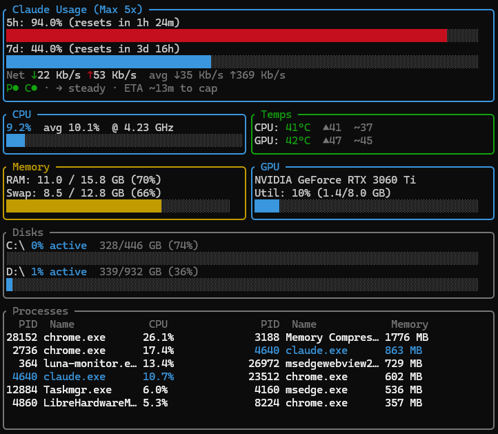

# Utils

A collection of lightweight, open-source utilities built for daily use on Windows. Each tool lives in its own folder with its own README.

MIT licensed. Contributions welcome.

## Tools

### [luna-monitor/](luna-monitor/) — Claude Code Developer Dashboard

Everything from monitor/ plus live Claude Code usage tracking via an embedded reverse proxy. Built in Rust for fast startup and low resource usage.

<p align="center">
  
</p>

**What it shows:**
- Live 5-hour and 7-day usage bars with reset countdown timers, pace indicator, and ETA to cap
- Proxy and API health status dots (P●/C●), network speeds — all inside one panel
- CPU sparkline with real frequency (via LibreHardwareMonitor auto-detection)
- GPU, memory, disk I/O with active %, temperatures, top processes
- `--doctor` interactive setup wizard (launches dashboard after configuration)

**How usage tracking works:** An embedded reverse proxy captures rate limit headers from Claude Code API responses. No extra API calls needed. If the proxy crashes, Claude Code falls back to the direct API — your workflow is never blocked.

**Stack:** Rust, ratatui, sysinfo, reqwest, nvml-wrapper, Windows PDH API

**Install:** Download `luna-monitor.exe` from [Releases](https://github.com/agamarora/utils/releases) and run it.

---

### [monitor/](monitor/) — Terminal System Monitor

A real-time system dashboard that runs entirely in your terminal. Think Task Manager, but minimal, fast, and keyboard-friendly.

**What it shows:**
- CPU utilisation as a rolling waveform (not just a number — you see the trend over time)
- Real-time CPU clock speed via LibreHardwareMonitor (not the static base clock that most tools report)
- Disk active time % (same metric as Task Manager) with per-drive read/write throughput
- GPU utilisation, VRAM, and temperature (NVIDIA)
- RAM and swap usage
- CPU and GPU temperatures
- Network speeds (current, average, peak)
- Top processes split by CPU and RAM usage

**Stack:** Python, psutil, Rich, pynvml, Windows PDH API, LibreHardwareMonitor

```bash
cd monitor && pip install -r requirements.txt && python monitor.py
```

> luna-monitor is the recommended tool — monitor/ is the original Python prototype.

## License

MIT — see [LICENSE](LICENSE).
